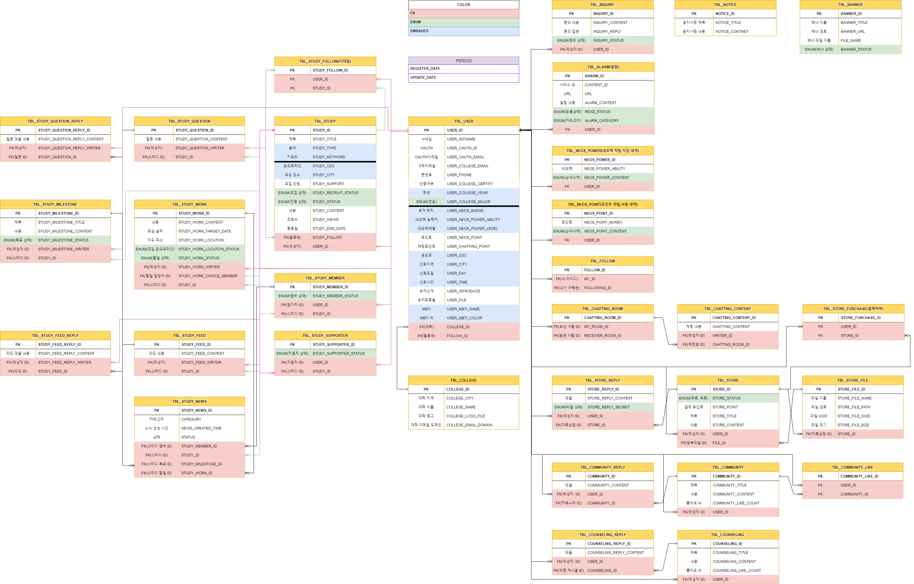

# NEOS
대학생활에 도움이 되는 다양한 경험을 제공하는 커뮤니티

# 프로젝트 목적 
대학생들의 공부를 도와줄 스터디 모집 서비스를 중심으로
필요한 자료를 사고파는 자료상점, 
 
자유롭게 의견을 주고 받는 자유게시판, 
익명으로 터놓을 수 있는 고민게시판까지 제공. 

# 담당 업무
- 마이페이지 서비스 전체 
(정보, 스터디, 자료상점, 구독, 알림, 네오력, 포인트)
- 자료상점 서비스 전체 
(자료 업로드, 포인트 결제, 다운로드등등)

# 프로젝트를 진행하면서 
- 어려웠던 부분 : 첩부파일 업로드, 다운로드 기능을 구현하는 부분과 유저 + 자료상점 게시글의 결제 여부를 연관지어 생각하는 부분이 어려웠다.
- 문제를 해결했던 부분 : 수업 내용을 바탕으로 차근히 서비스에 맞게 변경하면서 모든 기능을 구현해낼 수 있었다. 특히 유저, 자료상점 게시글 결제 여부를 확인하고 알맞은 페이지로 이동하는 부분에 대하여 개념을 잡고 하나씩 풀어나가면서 기능을 구현할 수 있었다.
- 협업의 중요성 : 서비스가 커지면서 함께 의견을 조율하고 맞추어 나가는 부분이 가장 중요함을 느낄 수 있었다. 모두의 서비스가 서로 연결되어 있기에 많은 의사소통이 필요하였고,
서로 부족한 점을 도와줄 수 있다는 부분에서 협업의 중요성을 크게 느낄 수 있었다.
- 총평 : 팀원들과의 의사소통도 원활히 하고 많은 부분을 서로 도와가면서 완성했기에 의미있는 프로젝트였다.
전 프로젝트와 주제가 비슷해서 더 많고 어려운 기능들을 추가하였는데도 더욱 완성도 있는 결과물을 얻을 수 있었다. 짧은 국비 기간이였지만 많이 성장함을 느낄 수 있었다.

# 구현 기술 스택 
- JDK 11.0.15
- Oracle (11g)
- Jpa
- SpringBoot 2.7.5
- Thymeleaf
- HTML, CSS, JS
- JQuery 3.6
- QueryDsl 5.0
- AJAX
- WebSocket
- Quartz
- OAuth 2.0 Naver/Kakao/Google
- KakaoMap api
- Summernote api 
- BootPay api
- Gmail api

# 테스트 환경
- Junit 5.0
- Postman

# Dependency
- Gradle

# ERD

# 프로젝트 소개
!(./1.jpeg)

