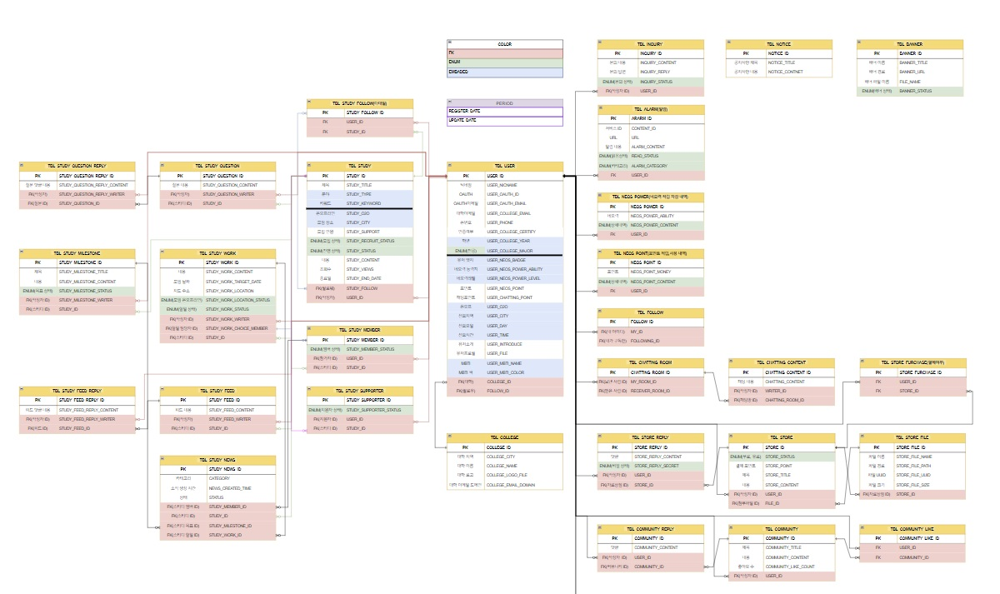

# NEOS
대학생활에 도움이 되는 다양한 경험을 제공하는 커뮤니티

# 프로젝트 목적 
대학생들의 공부를 도와줄 스터디 모집 서비스를 중심으로
필요한 자료를 사고파는 자료상점, 
자유롭게 의견을 주고 받는 자유게시판, 
익명으로 터놓을 수 있는 고민게시판까지 제공. 

# 구현 기술 스택 
- JDK 11.0.15
- Oracle (11g)
- Jpa
- SpringBoot 2.7.5
- Thymeleaf
- HTML, CSS, JS
- JQuery 3.6
- QueryDsl 5.0
- AJAX
- WebSocket
- Quartz
- OAuth 2.0 Naver/Kakao/Google
- KakaoMap api
- Summernote api 
- BootPay api
- Gmail api

# 테스트 환경
- Junit 5.0
- Postman

# Dependency
- Gradle

# ERD

# 프로젝트를 진행하면서
어려웠던 부분 :
문제를 해결했던 부분 :
협업의 중요성 :
총평 : 
